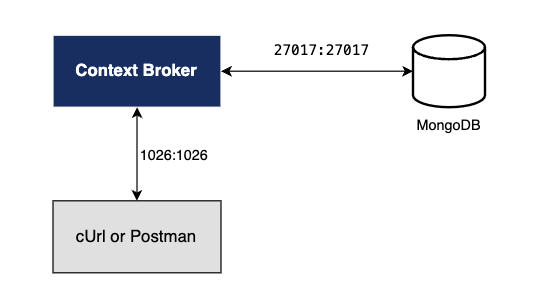

# Context Broker environment setup

This branch contains the setup for running an Orion Context Broker connected to a MongoDB instance using Docker Compose. The architecture is designed to facilitate easy deployment and management of the Context Broker and its database.

## Architecture
 

The architecture consists of two main components:
- [**Orion-LD Context Broker**](https://fiware-orion.readthedocs.io/en/latest/): Acts as the central component for managing context information.
- [**MongoDB**](https://www.mongodb.com/): Serves as the database for storing context data.

The two components are connected, with Orion-LD Context Broker exposed on port 1026.

## Prerequisites

To keep things simple, all components will be run using Docker. Docker is a container technology that allows different components to be isolated into their respective environments.

### Installing Docker

- **Windows**: Follow the instructions [here](https://docs.docker.com/desktop/install/windows-install/).
- **Mac**: Follow the instructions [here](https://docs.docker.com/desktop/install/mac-install/).
- **Linux**: Follow the instructions [here](https://docs.docker.com/desktop/install/linux-install/).

### Installing Docker Compose

Docker Compose is a tool for defining and running multi-container Docker applications. A series of YAML files are used to configure the required services for the application. This means all container services can be brought up in a single command.

- Docker Compose is installed by default as part of Docker for Windows and Docker for Mac.
- **Linux**: Follow the instructions [here](https://docs.docker.com/compose/install/).

### Checking Docker and Docker Compose Versions

You can check your current Docker and Docker Compose versions using the following commands:

```sh
docker-compose -v
docker version
```
Please ensure that you are using Docker version 24.0.x or higher and Docker Compose 2.24.x or higher and upgrade if necessary.

## Getting Started

To set up the environment, follow these steps:

1. Clone the repository:
    ```sh
    git clone https://github.com/asmataamallah25/ai_on_edge_with_fiware.git
    cd ai_on_edge_with_fiware
    cd context_broker_env_setup
    ```

2. Check out the specific branch:
    ```sh
    git checkout context_broker_env_setup
    ```

3. Start the containers:
    ```sh
    docker-compose up -d
    ```
**Note:**
the docker-compose -d option runs containers in detached modes:
- It starts the containers specified in the docker-compose.yml file in the background.
- Output from the containers is not displayed in the terminal.
- The containers continue running even if you close the terminal session.

4. To verify that the Orion Context Broker is running correctly:
    ```sh
    curl http://localhost:${EXPOSED_PORT:-1026}/version
    ```

## Stopping the Setup

To stop the running containers:

    ```sh
    docker-compose down
    ```
    
This setup is tested on MacBook Pro having an M3 chip.